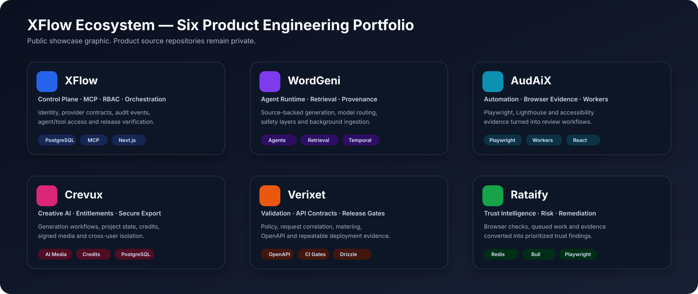
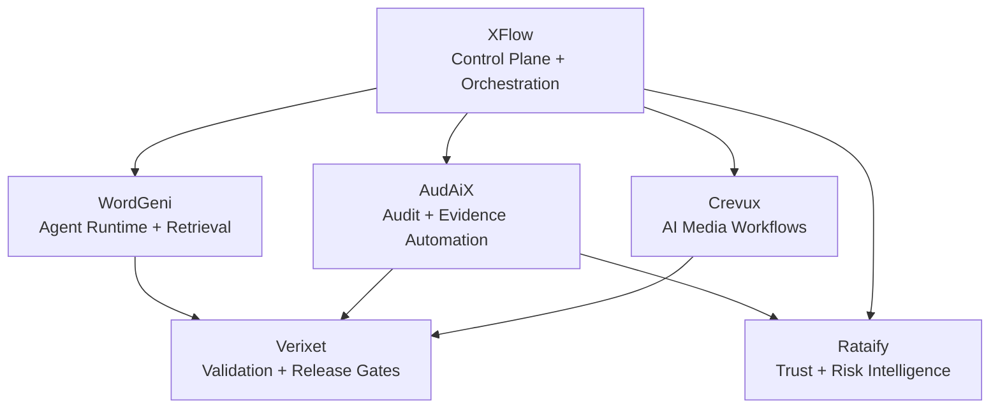

# XFlow Ecosystem

A six-product full-stack and AI systems portfolio focused on orchestration, agent workflows, verification, trust, audit evidence, creative tooling, and research-backed content.

This workspace is the public engineering showcase for the ecosystem. The underlying product repositories remain private; this repository exposes architecture, recruiter case studies, security/release models, and sanitized technical proof without publishing proprietary implementation code.

> The visual above is a public portfolio graphic summarizing the six products and their engineering roles. It is not a screenshot of the private applications.

## Start Here

If you are reviewing this portfolio for a software or AI engineering role:

1. **[Open the Reviewer Engineering Packet](https://xflowx.com/for-reviewers)** — fastest guided review of the six-product ecosystem, architecture, engineering evidence, role fit, and ownership boundaries.
2. Read the **[Public Showcase](docs/ecosystem/public-showcase.md)** for the six-product map and review path.
3. Read the **[Recruiter Brief](docs/ecosystem/recruiter-brief.md)** for a concise overview.
4. Review **[Public Technical Proof](docs/ecosystem/public-technical-proof.md)** for sanitized examples of authorization, tenancy, idempotency, AI review boundaries, and release gates.
5. Use the **[case-study index](docs/ecosystem/case-studies/README.md)** for product-by-product depth.

The strongest engineering examples are:

- **XFlow** — control plane, workflow orchestration, API contracts, RBAC, auditability, provider integrations, and agent/MCP-facing workflows.
- **WordGeni** — AI runtime, retrieval, provenance, prompts, safety, model routing, source ingestion, and human review.
- **AudAiX** — evidence-driven audit automation using browser tooling, workers, security/accessibility checks, and production-readiness workflows.

## Engineering Profile

This ecosystem demonstrates practical work across:

- **Agentic AI systems** — dedicated agent runtimes, prompt and retrieval layers, tool-oriented workflows, context handling, model routing, and human-review boundaries.
- **MCP and tool integration** — XFlow includes builder-agent and MCP-facing developer flows for external tool consumption and controlled API access.
- **Full-stack product engineering** — React/Next.js frontends, API layers, workers, background jobs, typed contracts, auth, billing, and multi-surface product workflows.
- **PostgreSQL and data boundaries** — relational persistence, workspace isolation, schema ownership, audit trails, usage/entitlement data, and production verification paths.
- **Reliability and release engineering** — smoke tests, route integrity checks, RBAC matrices, environment validation, CI gates, live verification, and fail-closed production checks.
- **Security and governance** — explicit auth boundaries, encrypted token handling, audit events, secret-management rules, tenant isolation, and documented release standards.

The goal is not to present disconnected demos. The portfolio shows how multiple applications can share engineering standards while retaining clear product, security, data, and deployment boundaries.

## Core Products

| Product | Engineering focus | Status | Case study |
| --- | --- | --- | --- |
| **XFlow** | Control plane, workflow orchestration, provider contracts, RBAC, auditability, agent/MCP workflows | Implemented | [XFlow](docs/ecosystem/case-studies/xflow.md) |
| **WordGeni** | AI runtime, retrieval, provenance, prompt/safety layers, model routing, source-backed writing | Implemented | [WordGeni](docs/ecosystem/case-studies/wordgeni.md) |
| **AudAiX** | Automated audits, browser evidence, workers, monitoring, accessibility/security checks | Implemented | [AudAiX](docs/ecosystem/case-studies/audaix.md) |
| **Verixet** | Execution validation, release gates, billing/entitlement authority, verification | Implemented | [Verixet](docs/ecosystem/case-studies/verixet.md) |
| **Rataify** | Trust, risk, scam detection, and credibility workflows | Implemented | [Rataify](docs/ecosystem/case-studies/rataify.md) |
| **Crevux** | AI-assisted creative production, asset workflows, and generation/editing surfaces | Implemented | [Crevux](docs/ecosystem/case-studies/crevux.md) |

The core ecosystem is intentionally limited to these six products. Other repositories in the account are separate projects or experiments and are not part of this architecture narrative.

## Architecture

The exact deployment topology varies by product. This public diagram communicates the authority and workflow model without exposing private service topology or deployment secrets.

## Technical Proof Without Publishing Private Source

The public portfolio includes representative, sanitized examples of the engineering patterns used across the private product repositories:

- authenticated tool boundaries
- workspace-scoped authorization
- database-backed tenancy
- idempotent background execution
- model-output review boundaries
- audit trails
- release verification gates
- failure-mode thinking around retries, timeouts, invalid output, migration drift, and cross-user access

See **[Public Technical Proof](docs/ecosystem/public-technical-proof.md)** for the examples.

## What To Inspect

For engineering review, the strongest proof is in the implementation model and verification discipline rather than screenshots alone:

- API and provider contracts
- Auth and RBAC enforcement
- Agent runtime and retrieval boundaries
- MCP/tool-facing integration paths
- PostgreSQL schemas and workspace isolation
- Worker/background-job design
- Route and contract verification
- CI, smoke, environment, and release gates
- Security and secret-management documentation
- Production verification notes that distinguish implemented code from unverified live state

## Architecture and Governance

- [Reviewer Engineering Packet](https://xflowx.com/for-reviewers)
- [Public showcase](docs/ecosystem/public-showcase.md)
- [Public technical proof](docs/ecosystem/public-technical-proof.md)
- [Architecture map](docs/ecosystem/architecture.md)
- [Product map](docs/ecosystem/product-map.md)
- [Security model](docs/ecosystem/security-model.md)
- [Release model](docs/ecosystem/release-model.md)
- [Professional readiness checklist](docs/ecosystem/checklists/professional-readiness.md)
- [Recruiter brief](docs/ecosystem/recruiter-brief.md)
- [Case studies](docs/ecosystem/case-studies/README.md)

## Verification Philosophy

A recurring theme across the ecosystem is separating **implemented behavior** from **verified production behavior**.

The repositories use linting, type checks, unit/integration tests, route checks, RBAC matrices, environment validation, smoke tests, and release gates where appropriate. Production claims remain explicitly bounded when live evidence has not been collected.

That distinction is deliberate: portfolio documentation should make system capability easy to inspect without presenting local or staged behavior as proof of a production deployment.

## Current Portfolio Readiness

| Area | Status |
| --- | --- |
| Core product architecture documented | Implemented |
| Recruiter-facing case studies | Implemented |
| Public sanitized technical proof | Implemented |
| Security and release models | Implemented |
| App-level verification commands | Implemented |
| Cross-app operating model | Implemented |
| Production deployment proof across every core app | Needs current verification |
| Unified public demo flow | In progress |

## Why This Repository Exists

This repository is the public portfolio index for the XFlow ecosystem. It is designed to answer three questions quickly:

1. **Can I build full products end-to-end?** — The six applications span UI, APIs, workers, data, auth, billing, AI, audit, and operational tooling.
2. **Can I build AI systems beyond a single model call?** — The portfolio includes agent runtimes, retrieval, prompt/safety layers, tool/MCP workflows, context handling, model routing, and review boundaries.
3. **Can I operate software with engineering discipline?** — The ecosystem includes release gates, verification matrices, security boundaries, observability, documentation, and explicit production-proof requirements.

For hiring review, begin with the **[Reviewer Engineering Packet](https://xflowx.com/for-reviewers)**, then inspect the [Public Showcase](docs/ecosystem/public-showcase.md), [Recruiter Brief](docs/ecosystem/recruiter-brief.md), [Public Technical Proof](docs/ecosystem/public-technical-proof.md), and the product case studies.
