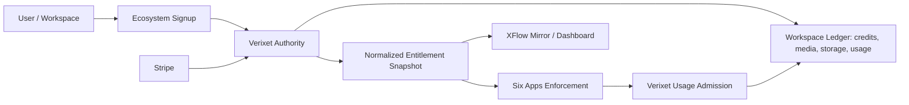

# Ecosystem Authority Boundary

Verixet is the production authority for billing, Stripe, entitlements, usage admission, credit balances, and storage allowance. XFlow consumes and mirrors Verixet entitlement snapshots for dashboard navigation, app access checks, and operator visibility. XFlow must not independently grant paid production access from local Stripe state.

Every completed ecosystem signup receives free-tier access to all six apps:

- `xflow`
- `verixet`
- `wordgeni`
- `crevux`
- `rataify`
- `audaix`

Paid subscriptions, bundles, AI credit packs, media credit packs, and storage add-ons layer on top of this baseline. Cancellations, refunds, disputes, and failed billing states can remove or reverse paid benefits, but they must not remove the baseline free app access.



## Production Environment

XFlow:

- `XFLOW_BILLING_AUTHORITY=verixet`
- `VERIXET_BILLING_CHECKOUT_URL`
- `VERIXET_BILLING_CHECKOUT_SECRET`
- `VERIXET_SIGNUP_URL`
- `VERIXET_SIGNUP_HANDOFF_SECRET`
- Do not set `XFLOW_ALLOW_LOCAL_STRIPE_CHECKOUT=1` in production.
- Do not set `XFLOW_ALLOW_LOCAL_BILLING_ENTITLEMENTS=1` in production.

Verixet:

- `STRIPE_SECRET_KEY`
- Stripe webhook secret consumed by `getEcosystemStripeWebhookSecret`
- Stripe price env vars for canonical plans, AI packs, media packs, and storage add-ons
- XFlow mirror/control-plane credentials for publishing normalized snapshots

## Snapshot Contract

Normalized Verixet snapshots should include:

- `workspace_id`
- `user_id` or profile id when applicable
- all-six baseline `appAccess`
- paid app access separately, such as `paidAppAccess`
- `planSlug` and bundle/offer slugs
- feature flags
- AI action, media image, media video, and storage balances
- `storage_gb` allowance
- usage limits and current billing status
- renewal and cancellation status
- safe Stripe customer, subscription, payment intent, and event references

## Backfill Plan

For existing completed ecosystem users, run the XFlow baseline backfill after deploying the code:

```powershell
cd apps/XFlow
$env:XFLOW_CONFIRM_BASELINE_BACKFILL='1'
npx tsx scripts/backfill-free-ecosystem-baseline.ts
```

For existing paid users, preserve paid subscriptions and ledger rows. The baseline only adds free app access underneath the existing paid state.
