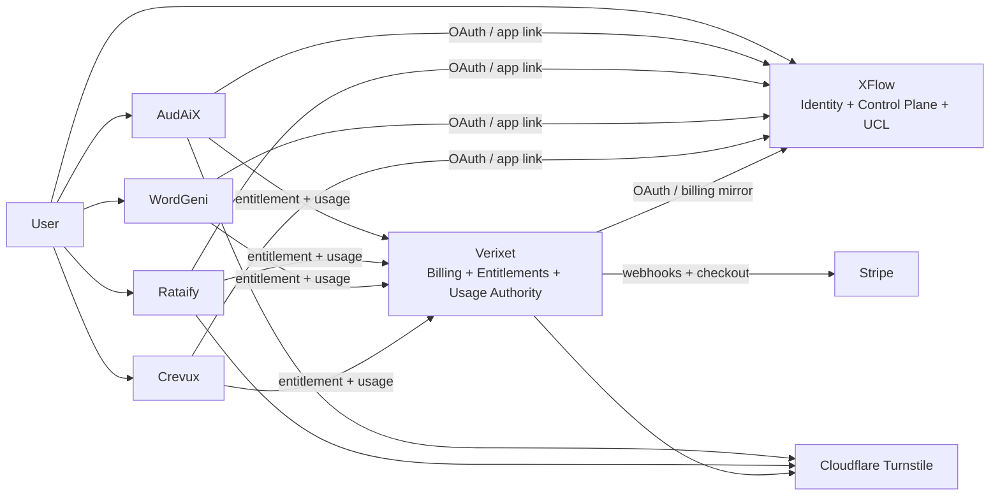
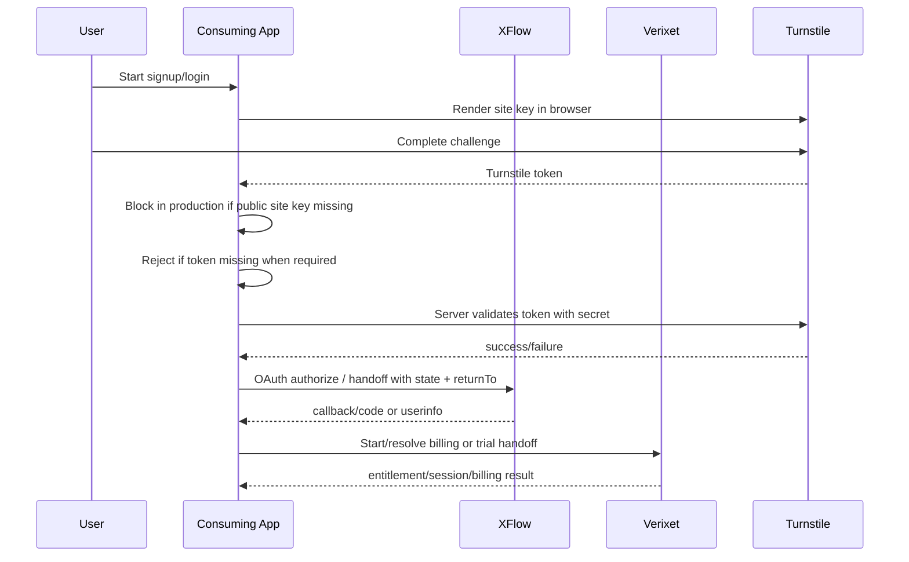
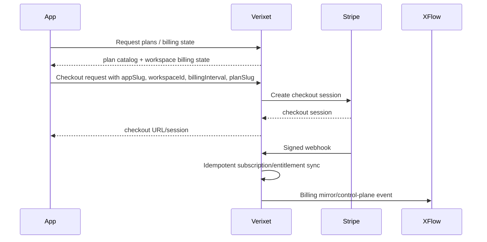
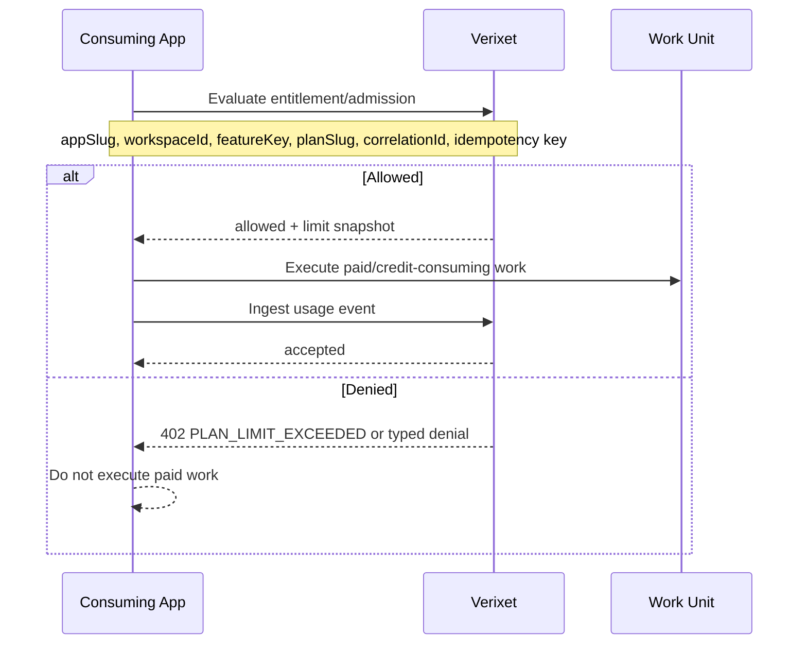
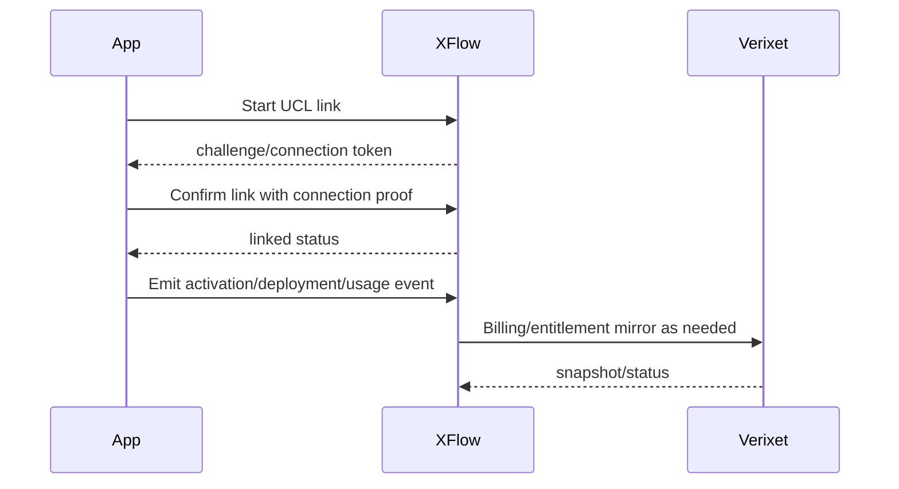
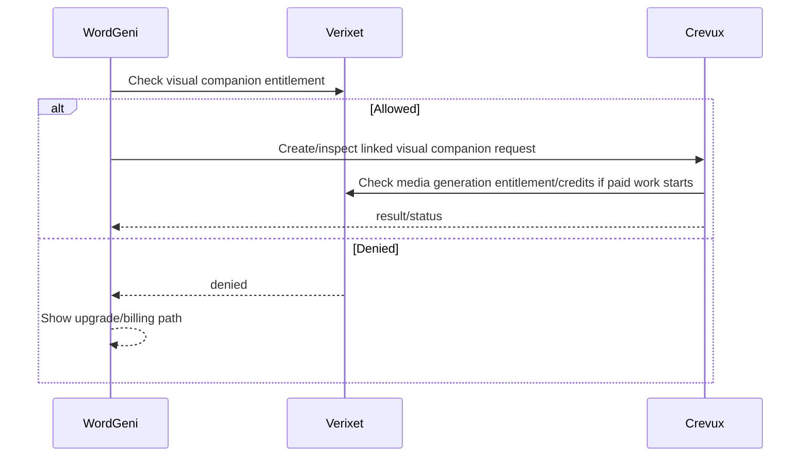
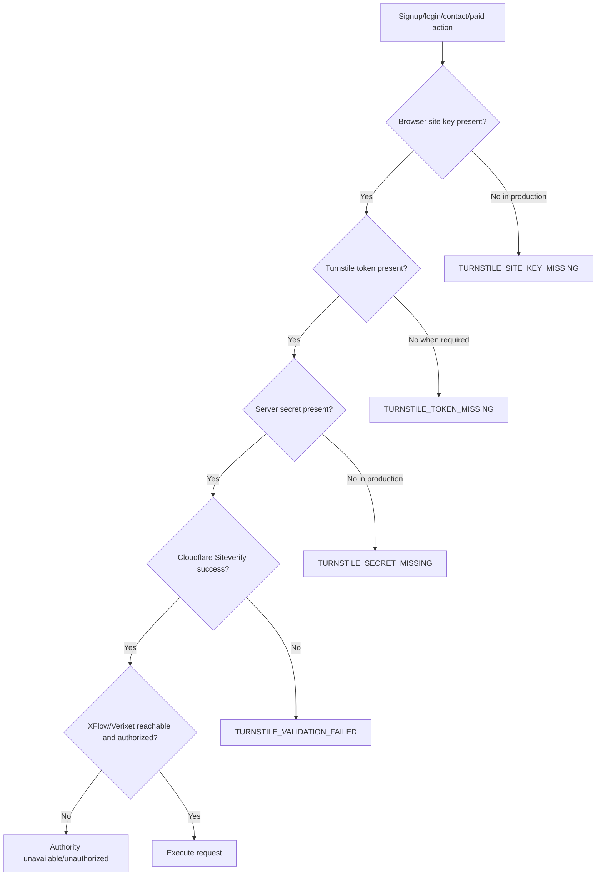

# Ecosystem Connection Map

Date: 2026-05-04

Machine-readable source: `ecosystem-contracts/routes.json` is now the canonical root route contract registry for Phase 1 validation. This document remains the human-readable map and should stay aligned with the JSON registry.

Before changing connection logic, follow the [Six-App Connection Discipline](six-app-connection-discipline.md).

## App Responsibilities

| App | Responsibility | Must not own |
| --- | --- | --- |
| XFlow | Identity, OAuth, control plane, app hub, UCL routing, app linking, event routing | Stripe billing authority, plan pricing authority |
| Verixet | Billing, governance, Stripe, entitlements, usage ingest, workspace billing authority | Identity authority, app-specific product execution |
| AudAiX | Audit, monitoring, improvement workflows | Billing authority, identity authority |
| Rataify | Trust, reviews, risk, privacy, reputation workflows | Billing authority, identity authority |
| WordGeni | Writing intelligence workflows and Crevux companion requests | Billing authority, identity authority |
| Crevux | AI media studio, credits/usage execution, media generation workflows | Ecosystem billing authority unless explicitly acting as local cache |

## Authority Boundaries

## Signup And Auth Flow

Required Turnstile env contract:

- Vite browser apps: `VITE_TURNSTILE_SITE_KEY`
- Next browser apps: `NEXT_PUBLIC_TURNSTILE_SITE_KEY`
- Server only: `TURNSTILE_SECRET_KEY`
- Development/test mocking only: app-specific mock flags are allowed only outside production.

## Billing And Checkout Flow

## Entitlement And Usage Flow

## UCL Linking And Event Flow

Token rule:

- Global service tokens are for installation/bootstrap or service-to-service administration only.
- Per-connection/UCL tokens are for workspace/app connection events.
- Usage ingest tokens are app-scoped Verixet tokens.
- Browser code must never receive service tokens, UCL secrets, Stripe secrets, Supabase service-role keys, or Turnstile secrets.

## WordGeni-To-Crevux Flow

Observed implementation points:

- WordGeni API: `apps/WordGeni/apps/api/src/routes/integrations/crevux.ts`
- WordGeni web: `apps/WordGeni/apps/web/src/components/visual-companion/*`
- Crevux API: `apps/CreVux/artifacts/api-server/src/routes/integrations/wordgeni.ts`

## Failure Mode Diagram

## Shared Headers And Fields To Standardize

| Field/header | Requirement |
| --- | --- |
| `appSlug` | Lowercase canonical slug from shared contract |
| `sourceApp` | Originating app slug for handoff/events |
| `selectedApp` | Target app slug for signup/app hub flows |
| `workspaceId` | Required for billing, entitlements, usage, UCL events |
| `connectionId` | Required for per-connection UCL events |
| `environment` | `development`, `staging`, or `production` |
| `billingInterval` | Shared enum, including any six-month/yearly claims only if Verixet supports them |
| `planSlug` | Verixet-owned slug |
| `correlationId` | Required in cross-app calls and logs |
| `Idempotency-Key` | Required for usage, checkout, credits, webhooks/replayable operations |
| `Authorization` | Bearer token type must match endpoint: service, UCL connection, usage ingest, or user session |
