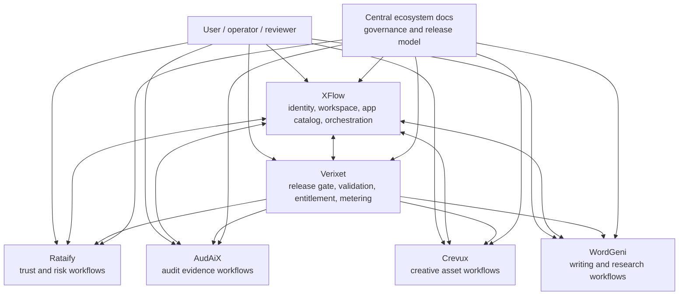
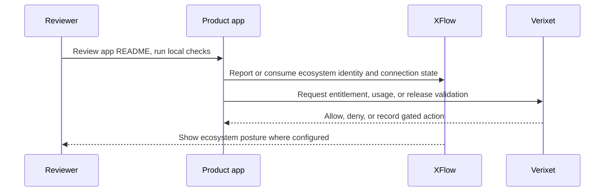

# Architecture Map

The ecosystem architecture is a governed hub-and-spoke model. XFlow coordinates app identity and workflow state, Verixet validates execution and release authority, and each core app owns its product domain.

## Boundary Model

| Boundary | Owner | Status |
| --- | --- | --- |
| Identity and workspace coordination | XFlow | implemented |
| App catalog and connection posture | XFlow | implemented |
| Release validation and execution gate | Verixet | implemented |
| Billing, entitlement, and usage authority | Verixet | implemented |
| Trust/risk domain data | Rataify | implemented |
| Audit/evidence domain data | AudAiX | implemented |
| Creative asset domain data | Crevux | implemented |
| Writing/research domain data | WordGeni | implemented |
| Production deployment proof for the six core apps | Cross-app | needs verification |

## Data And Control Flow

## Architecture Principles

- Keep authority boundaries explicit.
- Prefer local-safe verification before live checks.
- Do not duplicate billing, identity, or release authority inside satellite apps.
- Document unverified production claims as needs verification.
- Treat each core app as a standalone product with a clear ecosystem role.

## Mobile architecture

The approved first ecosystem mobile product is a separately delivered Crevux Android application built on a reusable mobile foundation. XFlow remains the identity/account authority, Verixet remains the billing/entitlement/usage authority, and Crevux owns mobile projects, media, editing history, generation jobs, and providers.

See [Crevux Android architecture](../mobile/crevux-android-architecture.md) and the [mobile v1 API contract](../mobile/crevux-mobile-v1-contract.md). Runtime implementation begins in MOBILE-1; these documents do not claim the target endpoints are already implemented.
