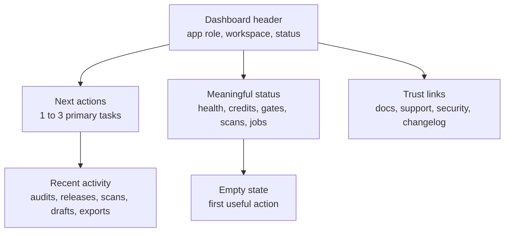

# Ecosystem Dashboard Standard

Every core app dashboard should quickly answer: what is this app doing, what needs attention, what should the user do next, and what changed recently.

## Current Findings

Source inspection shows dashboards exist across the core apps, but the home/dashboard pattern is inconsistent. Some apps appear rich but dense, some are domain-specific with many tabs, and some need clearer first-run framing.

## Recommended Standard

## Required Dashboard Blocks

| Block | Purpose |
| --- | --- |
| Product role | One sentence explaining what this dashboard controls. |
| Workspace/account context | Shows current workspace/user context where applicable. |
| System/product status | Shows meaningful current state, or clearly says verification is needed. |
| Next actions | Primary workflow tasks, not marketing copy. |
| Recent activity | Real events, jobs, reports, drafts, scans, releases, or empty state. |
| Empty state | Tells users how to create the first useful object. |
| Utility rail | Docs, support, security, changelog, and status. |

## App-By-App Gaps

| App | Priority | Dashboard gap |
| --- | --- | --- |
| XFlow | P1 | Needs dashboard first screen to prioritize app health, connection state, and next control-plane actions over dense operator detail. |
| Verixet | P1 | Needs release-gate dashboard to foreground request validation, policy status, and recent gate decisions. |
| Rataify | P1 | Needs trust dashboard to foreground site status, scan queue, highest-risk findings, and next remediation action. |
| AudAiX | P1 | Needs audit dashboard to foreground sites, latest evidence, audit health, and report/action queue. |
| Crevux | P1 | Needs studio dashboard to foreground current projects, credit state, export queue, and recent assets. |
| WordGeni | P1 | Needs writing dashboard to foreground projects, sources, drafts, provenance issues, and next writing action. |

## Fake-Metric Avoidance

Dashboards must not show unverified uptime, customer count, revenue, risk score, scan count, or usage metrics. If the data source is missing, show a guided empty state or needs verification state.

## Priority Ranking

| Priority | Dashboard problem |
| --- | --- |
| P0 | Main dashboard exposes high-risk operations or raw diagnostics without product framing. |
| P1 | Dashboard does not explain current state or next action within 30 seconds. |
| P1 | Recent activity and empty states are missing or inconsistent. |
| P1 | Status indicators use different language per app. |
| P2 | Cards, typography, and action hierarchy differ too much across apps. |
| P3 | Shared dashboard summary schema could be extracted later. |

## Implementation Checklist

- [x] Identify the dashboard entry route for each core app.
- [ ] Verify first screen at desktop and mobile widths.
- [x] Add product role, status, next action, recent activity, and empty state inventory.
- [ ] Remove or demote raw debug/admin panels from normal dashboards.
- [x] Align badge labels and severity language.
- [ ] Ensure every metric has a real source.
- [ ] Capture screenshots after implementation for review.

## Phase 6 Implementation Notes

Phase 6 added dashboard-standard framing to the six core app entry screens without backend changes, shared package extraction, or fake activity/status.

| App | Dashboard entry point | Implemented standard blocks |
| --- | --- | --- |
| XFlow | `apps/XFlow/src/components/dashboard/command-center/CommandCenterOverviewPage.tsx` | Added control-plane purpose, honest readiness label, recent activity/empty-state copy, and real next-action links. |
| Verixet | `apps/Verixet/src/components/dashboard/VerixetCommandCenterDashboard.tsx` | Added validation/release-gate purpose, readiness mapping, sourced recent activity count or empty state, and real workflow framing. |
| Rataify | `apps/RatAiFy/client/src/features/trustDashboard/components/TrustDashboardSurface.tsx` | Updated trust-dashboard purpose, mapped unknown/no-site/no-score states to setup or verification language, and kept scan/domain/issues/status actions real. |
| AudAiX | `apps/AudAix/dashboard/src/features/auditDashboard/AuditDashboardCommandCenter.tsx` | Added audit/evidence purpose, primary evidence/report/launchpad actions, recent activity or empty state, and shared readiness labels. |
| Crevux | `apps/CreVux/artifacts/image-gen/src/components/dashboard/CrevuxDashboardHome.tsx` | Replaced unsourced workspace/production-ready claims with readiness language, kept visual identity, and reduced top actions to four real workflows. |
| WordGeni | `apps/WordGeni/apps/web/src/app/(dashboard)/dashboard/page.tsx` | Added writing/research purpose, readiness from project load state, project activity or honest empty state, and real creation/project/canvas actions. |

Runtime desktop/mobile screenshots remain needs verification. All dashboard values should continue to come from existing app data models or explicit empty states.
