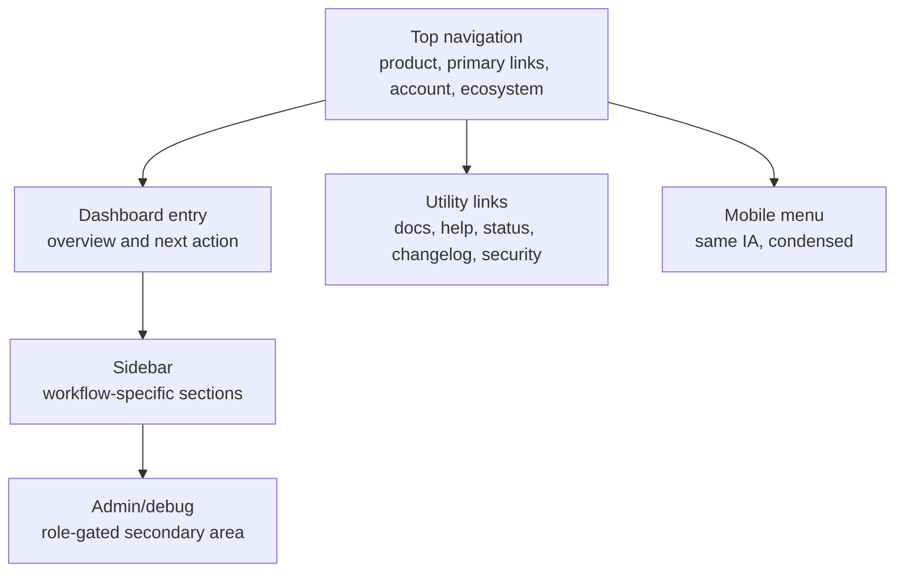

# Ecosystem Navigation Standard

This standard defines the target navigation model for the app family. It is not an implementation package and does not introduce new runtime code.

## Current Findings

Source inspection shows each core app has navigation, but the patterns differ:

- XFlow and Verixet have mature dashboard/operator routes with many controls.
- Rataify, AudAiX, Crevux, and WordGeni have domain-specific dashboards with multiple subareas.

## Recommended Standard

## Navigation Zones

| Zone | Required content | Notes |
| --- | --- | --- |
| Product mark | App name and logo/mascot when appropriate | Must use canonical product name. |
| Primary nav | 3 to 6 main product areas | Avoid duplicating sidebar labels. |
| Dashboard entry | One clear route for signed-in work | README should name it. |
| Account/settings | Account, workspace, billing, settings | Put in a predictable right/top or user-menu zone. |
| Help/status/docs | Docs, support, status, changelog, security | Keep as utility links, not core workflow links. |
| Admin/debug | Admin, diagnostics, internal tools | Role-gated and visually secondary. |
| Mobile | Collapsed menu with active state | Must preserve account and help access. |

## App-By-App Gaps

| App | Priority | Gap |
| --- | --- | --- |
| XFlow | P1 | Needs one documented user-facing hierarchy for apps, workflows, admin, support, and ecosystem docs. |
| Verixet | P1 | Needs dashboard module compression and a predictable utility nav area. |
| Rataify | P1 | Needs clearer separation of trust workflow navigation from support/admin/superadmin routes. |
| AudAiX | P1 | Needs consistent global shell over many dashboard pages and site tabs. |
| Crevux | P1 | Needs a single navigation vocabulary for studio, create, admin, Labs, and mobile surfaces. |
| WordGeni | P1 | Needs consistent account/status/help placement across workspace, dashboard, and admin layouts. |

## Dead Link And Route Audit Standard

Every core app should maintain:

- source route inventory or app-router route check;
- README route references that match real routes;
- no primary nav links to inaccessible debug/admin routes for normal users;
- active route state for top nav and sidebar;
- mobile route parity with desktop.

## Priority Ranking

| Priority | Navigation problem |
| --- | --- |
| P0 | User lands on an app and cannot tell where to start or sees raw debug/workstation noise first. |
| P1 | Primary nav, sidebar, and dashboard entry disagree. |
| P1 | Account/settings/help/status placement changes between apps. |
| P1 | Admin/debug links compete with normal user workflows. |
| P2 | Labels are product-specific but not ecosystem-consistent. |
| P3 | Utility links could later be generated from shared metadata. |

## Implementation Checklist

- [ ] Define one dashboard entry route per app.
- [ ] List top nav labels and sidebar labels per app.
- [ ] Compare nav routes to README and docs.
- [ ] Verify active route state.
- [ ] Verify mobile nav parity.
- [ ] Move admin/debug links into role-specific secondary areas.
- [ ] Add utility links for docs, support, security, status, and changelog.
- [ ] Recheck with browser screenshots before implementation is marked complete.
