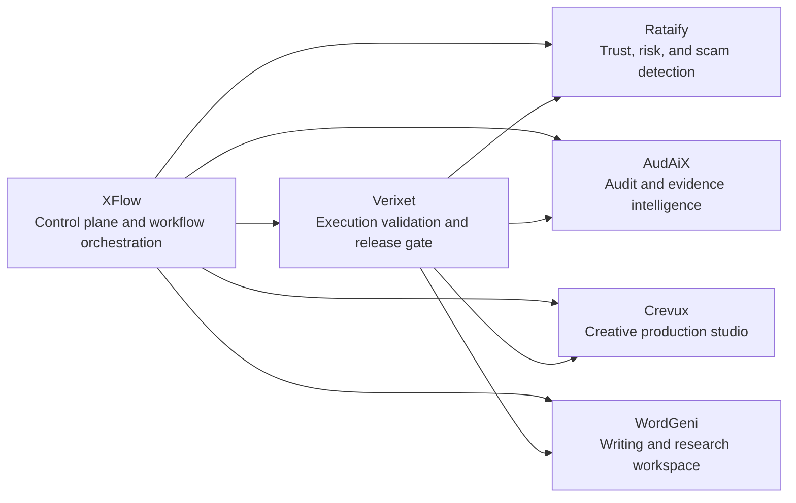

# Product Map

This map defines the role of each product in the ecosystem and keeps naming consistent across repos.

## Product Roles

| Product | Role summary | Status | Notes |
| --- | --- | --- | --- |
| XFlow | Ecosystem control plane and workflow orchestration. | implemented | Identity, workspace, app catalog, connection, and workflow coordination. |
| Verixet | Execution validation and release gate. | implemented | Validation, usage, entitlement, billing authority, and release policy. |
| Rataify | Trust, risk, scam detection, and credibility layer. | implemented | Website trust checks, risk signals, scan outputs, and remediation workflows. |
| AudAiX | Audit and evidence intelligence layer. | implemented | Browser evidence, Lighthouse, accessibility, route discovery, artifacts, and monitoring. |
| Crevux | Creative production and asset workflow studio. | implemented | Image/media generation, enhancement, gallery, export, credits, and asset flow. |
| WordGeni | AI writing and research workspace. | implemented | Source-backed drafting, provenance, editor workflows, and writing operations. |
## Portfolio Lanes

- Governance lane: XFlow and Verixet.
- Trust/evidence lane: Rataify and AudAiX.
- Creation lane: Crevux and WordGeni.

## Claims Discipline

Product status describes repository implementation and documentation state. Production deployment, customer use, revenue, and public-docs availability remain needs verification unless backed by current release evidence.
