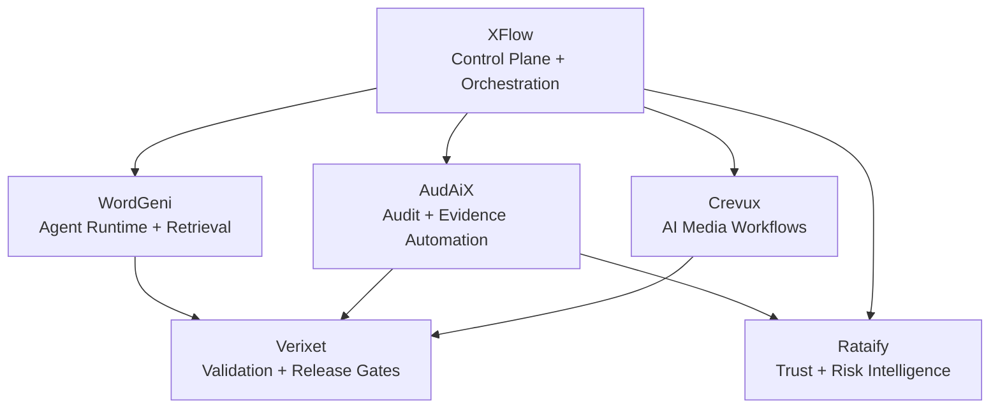

# Public Showcase

The product repositories behind this ecosystem remain private. This public workspace is intentionally designed to show architecture, product scope, engineering decisions, verification practices, and sanitized technical proof without publishing proprietary implementation code.

## Six-product portfolio

### XFlow — control plane and orchestration

Core concerns: identity, workspaces, RBAC, audit trails, provider contracts, MCP/tool-facing workflows, encrypted connection handling, and release verification.

**Best evidence:** [XFlow case study](case-studies/xflow.md)

### WordGeni — agent-enabled research and writing

Core concerns: dedicated AI runtime, retrieval, provenance, prompt/safety boundaries, model routing, source ingestion, background workers, and human-reviewable output.

**Best evidence:** [WordGeni case study](case-studies/wordgeni.md)

### AudAiX — evidence and audit automation

Core concerns: Playwright browser automation, Lighthouse, axe, worker execution, artifact/evidence handling, monitoring, and production-readiness scoring.

**Best evidence:** [AudAiX case study](case-studies/audaix.md)

### Crevux — AI media workflows

Core concerns: generation/editing workflows, API boundaries, PostgreSQL state, credits and entitlements, secure export paths, and cross-user isolation.

**Best evidence:** [Crevux case study](case-studies/crevux.md)

### Verixet — validation and release gates

Core concerns: API contracts, request correlation, policy checks, OpenAPI, migration verification, metering, billing/entitlements, and release evidence.

**Best evidence:** [Verixet case study](case-studies/verixet.md)

### Rataify — trust and risk intelligence

Core concerns: Playwright inspection, Redis/Bull workers, PostgreSQL-backed findings, prioritized remediation, auth/billing boundaries, and release checks.

**Best evidence:** [Rataify case study](case-studies/rataify.md)

## System relationships

The diagram is intentionally conceptual. It communicates authority and workflow relationships without exposing deployment secrets or private service topology.

## What is intentionally public

- product responsibilities
- architecture and data-ownership boundaries
- recruiter case studies
- release/security models
- sanitized technical examples
- verification philosophy
- selected status and readiness documentation

## What remains intentionally private

- complete source code
- private environment configuration
- provider credentials and secrets
- internal deployment details
- proprietary implementation choices not needed for hiring review
- customer/user data

## Review path for recruiters

A technical reviewer can understand the work without access to the private repositories by following this sequence:

1. Read the root README for the system overview.
2. Review the [Recruiter Brief](recruiter-brief.md).
3. Read the [public technical proof](public-technical-proof.md).
4. Choose one or more [case studies](case-studies/README.md).
5. Review the [security model](security-model.md) and [release model](release-model.md) for operating discipline.

Private source can remain private while the public portfolio still demonstrates system design, engineering judgment, and production-oriented thinking.
