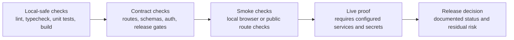

# Verification And Release Model

The ecosystem release model favors repeatable evidence over informal demo readiness.

## Status Vocabulary

| Status | Meaning |
| --- | --- |
| implemented | Code, docs, or templates exist in the repo. |
| in progress | Work exists but is incomplete, split across phases, or not fully normalized. |
| planned | Intended future work with no current proof requirement. |
| needs verification | Claim requires current live proof, owner confirmation, or external service evidence. |

## Release Hygiene Expectations

- README explains what the app does, why it matters, how to run it, and how it fits the ecosystem.
- Governance files and GitHub templates exist in each core app repo.
- CHANGELOG starts at the current package version when old release history is not curated.
- SECURITY and SUPPORT avoid fake public contact addresses.
- Local checks are documented separately from live checks.
- Production deployment claims are marked needs verification unless current evidence exists.

## App Verification Summary

| Product | Package manager | Local baseline | Live or external checks |
| --- | --- | --- | --- |
| XFlow | npm | lint, typecheck, test, build, smoke | needs verification |
| Verixet | npm | lint, typecheck, test, build, smoke | needs verification |
| Rataify | npm | lint, typecheck, test, build, smoke | needs verification |
| AudAiX | npm | lint, typecheck, test, build, smoke | needs verification |
| Crevux | pnpm | lint, typecheck, test, build, smoke | needs verification |
| WordGeni | pnpm | lint, typecheck, test, build, smoke | needs verification |

## Release Evidence Packet

Before external presentation, collect:

- app README and central ecosystem docs links;
- governance and release-template presence;
- local verification command output;
- screenshot or product media evidence where available;
- live deployment proof only when verified;
- known gaps marked needs verification.
