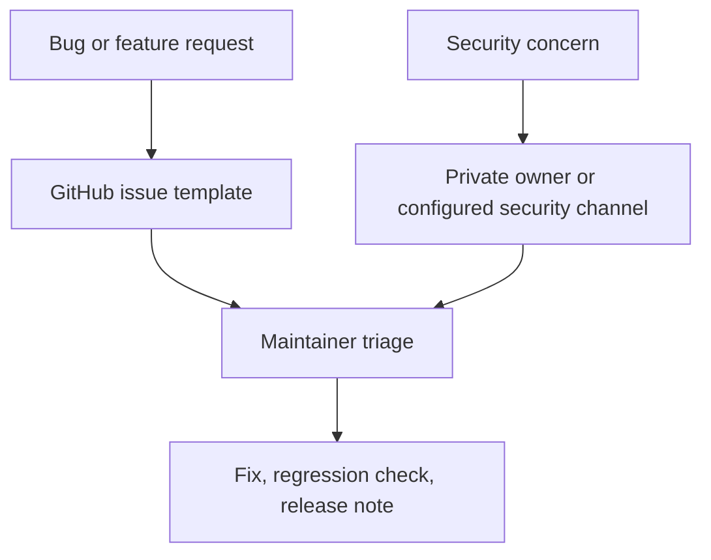

# Security And Support Model

The ecosystem uses private-first vulnerability reporting, conservative support language, and clear separation between product support and undisclosed security issues.

## Security Standards

- Do not open public issues for undisclosed vulnerabilities.
- Do not publish live secrets, bearer tokens, cookies, private logs, customer data, or exploit details.
- Use private repository owner contact or configured support/security channels unless a real public contact is already documented.
- Add regression coverage for security-sensitive fixes when practical.
- Treat auth, authorization, workspace isolation, billing, webhooks, file access, dependency updates, and release automation as security-sensitive.

## Support Standards

- Bug reports use `.github/ISSUE_TEMPLATE/bug_report.yml` when Issues are enabled.
- Feature requests use `.github/ISSUE_TEMPLATE/feature_request.yml` when Issues are enabled.
- Private/internal repos should not pretend to have public helpdesk operations.
- Support docs should point security reports to `SECURITY.md`.

## Shared Governance Files

Each core app should have:

- `LICENSE`
- `CODE_OF_CONDUCT.md`
- `CONTRIBUTING.md`
- `SECURITY.md`
- `SUPPORT.md`
- `CHANGELOG.md`
- `.github/ISSUE_TEMPLATE/bug_report.yml`
- `.github/ISSUE_TEMPLATE/feature_request.yml`
- `.github/PULL_REQUEST_TEMPLATE.md`
- `.github/release.yml`

## Current Security Posture

| Area | Status |
| --- | --- |
| Private vulnerability reporting language | implemented |
| Public issue templates | implemented |
| PR risk and validation template | implemented |
| Release-note categorization | implemented |
| Central support model | implemented |
| Formal public security SLA | needs verification |
| Public support inboxes | needs verification |
