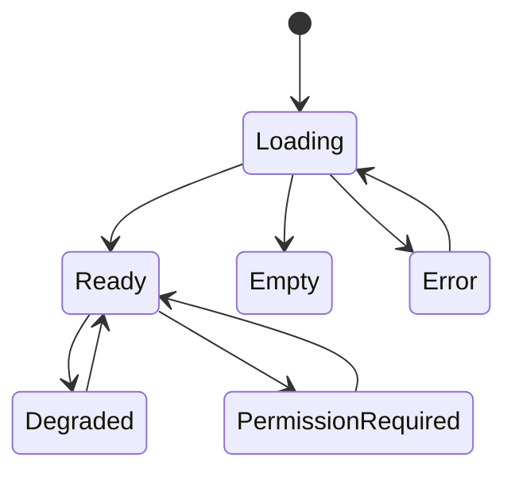

# Ecosystem UI State Standard

The ecosystem should use a shared state vocabulary even before shared components are extracted.

## Current Findings

Source inspection shows many routes and tests around health, status, loading, errors, auth, and degraded services. The problem is not absence of state handling; it is inconsistent presentation across apps.

## Recommended Standard

## Shared State Vocabulary

| State | UI requirement |
| --- | --- |
| Loading | Show what is loading and avoid layout jump. |
| Empty | Explain what is missing and provide the first action. |
| Error | Explain what failed, whether retry is safe, and where to find support. |
| Offline | Show local/offline limitation when applicable. |
| Permission required | Explain missing role, workspace, plan, or auth requirement without leaking private data. |
| Degraded | Show service dependency impact and next operator action where applicable. |
| Needs verification | Use when a claim depends on live service proof or owner confirmation. |

## App-By-App Gaps

| App | Priority | State-handling gap |
| --- | --- | --- |
| XFlow | P1 | Needs consistent visual treatment for dependency health, connection partials, auth denial, and release proof states. |
| Verixet | P1 | Needs consistent validation, billing, dashboard auth, and webhook degraded states across dashboard modules. |
| Rataify | P1 | Needs consistent scan loading, no-site empty, findings empty, support queue, and superadmin permission states. |
| AudAiX | P1 | Needs consistent audit running, no evidence, report unavailable, connector failure, and artifact permission states. |
| Crevux | P1 | Needs consistent generation queue, no project, no credits, export failed, provider degraded, and Labs gated states. |
| WordGeni | P1 | Needs consistent no sources, no drafts, provenance warning, ingestion running, auth required, and export error states. |

## Visual Standard

- Loading: compact skeleton or spinner with specific label.
- Empty: title, one-line explanation, one primary action, optional secondary docs link.
- Error: concise cause, correlation/request id if available, retry action, support path.
- Permission: role/plan/workspace requirement and safe next step.
- Degraded: impacted dependency, user impact, operator action, last checked timestamp when real.

## Priority Ranking

| Priority | State problem |
| --- | --- |
| P0 | Trading/execution or production-control degraded states are unclear. |
| P1 | Empty states do not guide first useful action. |
| P1 | Error states expose raw logs or hide actionable cause. |
| P1 | Permission states are inconsistent across auth, workspace, and plan gates. |
| P2 | Loading states cause layout jump or do not identify the pending action. |
| P3 | Shared state components can be extracted after one app proves the pattern. |

## Implementation Checklist

- [ ] Inventory loading, empty, error, permission, and degraded states per app.
- [ ] Replace raw debug text on user-facing screens with concise state messages.
- [ ] Add first-action CTAs to empty states.
- [ ] Keep request ids or correlation ids available without overwhelming the UI.
- [ ] Verify dark/light contrast for each state.
- [ ] Build one reference state component set before extracting shared code.
