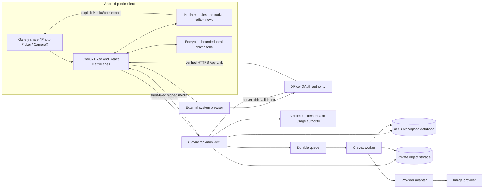

# Crevux Android Architecture Decision

Status: approved target architecture; runtime implementation starts in MOBILE-1.

## Decision

Deliver a Crevux-branded Android application as the first product built on a reusable mobile foundation. Retain the existing Expo/React Native client for navigation, product state, and cross-platform UI. Use first-party Kotlin modules or native views where Android integration, reliability, accessibility, or editor performance requires them.

Do not build a six-product super-app. Product applications remain separately delivered and independently releasable.

Authority is fixed:

- XFlow owns authentication, accounts, OAuth, and account lifecycle.
- Verixet owns billing, subscriptions, entitlements, and usage authority.
- Crevux owns projects, private media, editing history, generation jobs, and provider adapters.
- The Android application is an untrusted public client. It owns local drafts and presentation, not authoritative cloud state.

## Verified current state

The Crevux repository already contains an Expo/React Native mobile shell, SecureStore-backed local session handling, basic generation/job screens, image-generation and masked-edit provider adapters, private media storage, upload validation, and both legacy and workspace-scoped persistence.

It is not yet a safe native-client contract:

- Mobile authentication opens a web-oriented XFlow handoff and does not receive a verified native OAuth callback.
- XFlow public-client PKCE support is currently Chronicle-desktop-specific.
- Mobile jobs use legacy integer/user-scoped persistence while newer Crevux domain routes use UUID/workspace-scoped tables.
- Mobile generation couples the HTTP request to synchronous provider execution.
- Project mutation currently uses authorization inappropriate for an ordinary mobile user.
- Share Target, App Links, Photo Picker, CameraX, WorkManager, notifications, MediaStore export, masks, offline recovery, and version lineage are absent from the mobile client.
- Crevux-local billing and credits overlap the intended Verixet authority.

Historical audit documents do not override current runtime evidence. MOBILE-1 and later phases must re-verify their owning app repository at their approved base SHA.

## Target trust boundaries

No provider key, Verixet service credential, confidential OAuth client secret, database credential, or media-signing secret may be included in the application package.

## Android responsibilities

- Receive one `image/*` item initially through a narrowly declared Share Target.
- Import through read-only URI grants, inspect defensively, and copy into app-private storage.
- Use Photo Picker and CameraX rather than broad storage permissions.
- Keep encrypted, bounded, user-clearable local drafts and upload checkpoints.
- Use WorkManager for resumable upload/status synchronization; generation remains cloud-side.
- Render fold-aware compact and two-pane layouts using window-size and folding features, not device-name checks.
- Use Kotlin for App Links, intents, MediaStore, WorkManager, notifications, and the low-latency mask surface when React Native abstractions are insufficient.
- Save to Gallery only after an explicit export action and disclose that Gallery media is outside the private Crevux workspace boundary.

Galaxy Z Fold8 must not be described as S Pen compatible. Generic stylus input may use pressure, tool type, tilt, and platform palm-rejection signals on hardware that exposes them.

## Service responsibilities

### XFlow

Register a public `crevux-android` OAuth client with no secret, require Authorization Code with PKCE S256, exact redirect matching, one-time authorization codes, short-lived access tokens, single-use refresh rotation, token-family revocation, and account-deletion propagation. Each authorization attempt uses fresh cryptographically random state bound to the authorization request, PKCE verifier, redirect URI, and client instance; callbacks require an exact one-time match before expiry and fail closed by clearing the transaction.

Production and non-production authorization are separate trust domains. The production profile is client `crevux-android`, XFlow origin and issuer `https://xflowx.com`, client audience `crevux-android`, and callback `https://crevux.com/mobile/oauth/callback`. The single MOBILE-1 proof profile is staging-classified client `crevux-android-test`, XFlow origin and issuer `https://mobile-test.xflowx.com`, client audience `crevux-android-test`, and callback `https://mobile-test.crevux.com/mobile/oauth/callback`. Both profiles use package `com.crevux.mobile`.

Registrations and callbacks are exact and separate; wildcard origins or callbacks are forbidden. Build configuration must select one known profile before authorization or token use. Missing, unknown, or mismatched selection fails closed, and neither issuer, client audience, authorization code, access token, refresh token, nor token family crosses environments. `crevux.com` and `mobile-test.crevux.com` publish separate Digital Asset Links associations using different certificate identities. The dedicated MOBILE-1 test certificate is never valid on the production host, and the production certificate is never valid on the test host.

### Crevux

Expose `/api/mobile/v1`, validate XFlow identity server-side, authorize every resource by user and workspace, broker resumable private uploads, create durable jobs, maintain immutable lineage, isolate provider behavior behind adapters, and issue short-lived signed downloads.

### Verixet

Return the authoritative feature/limit/usage decision before paid work. Crevux may keep an auditable enforcement cache or debit/refund ledger, but it must not define an independent mobile plan catalog.

## Persistence and lineage

Canonical mobile IDs are UUIDs. All project, asset, upload, mask, job, version, provider-attempt, and export records are workspace-scoped. Original assets and existing versions are immutable and are never overwritten in place. Each version belongs to a project and job and records its source asset, prompt snapshot, result assets, provider/model provenance, optional mask, and—for refinements—its parent version.

MOBILE-3 must choose a forward migration from legacy mobile records; it must not silently dual-write two authoritative job models.

## Security and privacy invariants

- Require server-configured, capability-returned limits for compressed bytes, decoded pixels, width, height, and frame count; fail closed before upload when any mandatory limit is unavailable.
- Validate magic bytes and bounded decoded media; reject MIME/magic mismatch, malformed or polyglot input, unsupported animation/frame counts, decompression bombs, checksum mismatch, and cross-workspace completion.
- Require malware/content scanning before finalization, SHA-256 verification, resumable checkpoints, expiring upload sessions, idempotent completion, and cleanup of orphaned parts.
- Strip location/device EXIF by default and document any user-controlled preservation.
- Keep temporary files private and expire orphaned uploads.
- Scope signed URLs to the authorized resource and keep lifetimes measured in minutes.
- Recheck user/workspace ownership for every resource lookup and signed-link renewal.
- Treat Android intents, callback URIs, filenames, declared MIME types, prompts, and provider output as untrusted input.
- Bind idempotency to workspace, key, and canonical request fingerprint.
- Keep infrastructure/provider-attempt retries under the same logical job and idempotency identity. A user retry is a new child job with a new ID/key, failed or cancelled parent lineage, fresh entitlement and cost checks, explicit submission, and no reuse of prior charge authorization.
- Distinguish authentication, authorization, validation, rate limiting, policy refusal, entitlement denial, usage exhaustion, payment-required state, billing-authority outage, provider failure, and internal infrastructure failure.
- Do not claim provider cancellation unless authoritative provider evidence confirms it. Unsupported cancellation records `JOB_NOT_CANCELLABLE`; late results are quarantined, and usage/refund accounting follows provider-execution evidence.
- Account deletion immediately revokes the XFlow token family and blocks new work. Queued jobs are cancelled; active jobs request provider cancellation when supported and otherwise quarantine late results. Private project assets are deleted after terminal state or a bounded cleanup timeout. Completion is auditable through a minimal content-free tombstone whose retention remains an explicit owner/legal policy decision.
- Telemetry must exclude images, prompts, bearer tokens, signed URLs, and user content by default.

## Release boundaries

- Private beta target: after MOBILE-4.
- Store-quality v1 target: after MOBILE-7.
- Embroidery preparation: MOBILE-8.
- Security/privacy/Play closeout: MOBILE-9.

Samsung Gallery is an import/share/export integration point. No Samsung Photo Assist or private Galaxy AI API is assumed. Identity preservation is best-effort until measured regression evidence supports a stronger claim.

## Intentionally unsupported patterns

- Six-product Android super-app for the first release.
- WebView-only packaging or authentication.
- Embedded provider or confidential ecosystem secrets.
- Direct provider calls from the device.
- New satellite authentication or billing authority.
- Integer/user-only mobile ownership as the v1 contract.
- Synchronous provider work tied to the client HTTP connection.
- Silent paid retries or duplicate submissions.
- Fixed Fold8 pixel layouts or an S Pen compatibility claim.
